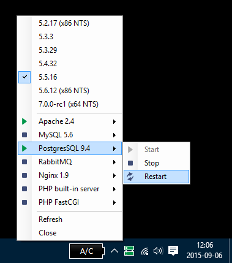

# PhpVersionSwitcher

## Installation

1. Download and extract a [release archive](https://github.com/JanTvrdik/PhpVersionSwitcher/releases) to directory of your choice

2. Create a base directory for PHP with the following structure:
	~~~
	%phpDir%/
	├── configurations/
	│   ├── 5.x.x.ini        # php.ini options for all 5.x.x versions
	│   ├── 5.3.x.ini        # php.ini options for all 5.3.x versions
	│   ├── 5.3.7.ini        # php.ini options specific for 5.3.7 version
	│   └── ...
	└── versions/
	    ├── 5.3.7/
	    │   ├── ext/
	    │   ├── ...
	    │   └── php.exe
	    ├── 5.6.0-rc3/
	    │   ├── ext/
	    │   ├── ...
	    │   └── php.exe
	    └── ...
	~~~

3. Create php.ini files in the `configurations` directory. In all php.ini files you can use `%phpDir%` variable. This is especially useful for `zend_extension`, e.g.
	~~~ini
	zend_extension = "%phpDir%\ext\php_opcache.dll"
	zend_extension = "%phpDir%\ext\php_xdebug.dll"
	~~~

4. Update `phpDir` option in `PhpVersionSwitcher.json` to contain path to the base PHP directory.

### Apache + PHP module

1. Add Apache service definition under `services` key:
	~~~json
	{
		"services": [
			{
				"label": "Apache 2.4",
				"name": "Apache2.4"
			}
		]
	}
	~~~

2. Update Apache configuration to contain something like this:
	~~~apache
	LoadModule php${PHP_VERSION_MAJOR}_module "C:/web/php/active/php${PHP_VERSION_MAJOR}apache2_4.dll"
	AddHandler application/x-httpd-php .php
	PHPIniDir "C:/web/php/active"
	~~~

### Nginx + PHP FastCGI

1. Add Nginx and PHP FastCGI definitions under `executables` key:
	~~~json
	{
		"executables": [
			{
				"label": "Nginx 1.9",
				"path": "C:\\web\\nginx\\nginx.exe"
			},
			{
				"label": "PHP FastCGI",
				"path": "C:\\web\\php\\active\\php-cgi.exe",
				"multiple": [
					{"args": "-b 127.0.0.1:9300", "label": "PHP FastCGI (9300)"},
					{"args": "-b 127.0.0.1:9301", "label": "PHP FastCGI (9301)"},
					{"args": "-b 127.0.0.1:9302", "label": "PHP FastCGI (9302)"},
					{"args": "-b 127.0.0.1:9303", "label": "PHP FastCGI (9303)"},
					{"args": "-b 127.0.0.1:9304", "label": "PHP FastCGI (9304)"},
					{"args": "-b 127.0.0.1:9305", "label": "PHP FastCGI (9305)"},
					{"args": "-b 127.0.0.1:9306", "label": "PHP FastCGI (9306)"},
					{"args": "-b 127.0.0.1:9307", "label": "PHP FastCGI (9307)"},
					{"args": "-b 127.0.0.1:9308", "label": "PHP FastCGI (9308)"},
					{"args": "-b 127.0.0.1:9309", "label": "PHP FastCGI (9309)"}
				]
			}
		]
	}
	~~~

2. Update Nginx configuration to contain something like this:
	~~~nginx
	upstream php_farm {
		server 127.0.0.1:9300 weight=1;
		server 127.0.0.1:9301 weight=1;
		server 127.0.0.1:9302 weight=1;
		server 127.0.0.1:9303 weight=1;
		server 127.0.0.1:9304 weight=1;
		server 127.0.0.1:9305 weight=1;
		server 127.0.0.1:9306 weight=1;
		server 127.0.0.1:9307 weight=1;
		server 127.0.0.1:9308 weight=1;
		server 127.0.0.1:9309 weight=1;
	}

	location ~ \.php$ {
		fastcgi_pass   php_farm;
		fastcgi_index  index.php;
		fastcgi_param  SCRIPT_FILENAME  $document_root$fastcgi_script_name;
		include        fastcgi_params;
	}
	~~~

### Caddy + PHP FastCGI

1. Add Caddy and PHP FastCGI definitions under `executables` key:
	~~~json
	{
		"executables": [
			{
				"label": "Caddy",
				"path": "C:\\web\\caddy\\caddy.exe"
			},
			{
				"label": "PHP FastCGI (9300)",
				"path": "C:\\web\\php\\active\\php-cgi.exe",
				"args": "-b 127.0.0.1:9300",
				"env": {
					"PHP_FCGI_CHILDREN": "7",
					"PHP_FCGI_MAX_REQUESTS": "0"
				}
			}
		]
	}
	~~~

2. Update Caddy configuration to contain something like this:
	~~~nginx
	# https://caddyserver.com/docs/fastcgi
	fastcgi / 127.0.0.1:9300 php
	~~~

### PHP built-in server

1. Add definition under `executables` key:

	~~~json
	{
		"executables": [
			{
				"label": "PHP built-in server",
				"path": "C:\\web\\php\\active\\php.exe",
				"args": "-S 127.0.0.1:9990 -t C:\\projects"
			}
		]
	}
	~~~

## License

The MIT License (MIT)

Copyright (c) 2014 Jan Tvrdík

Permission is hereby granted, free of charge, to any person obtaining a copy
 of this software and associated documentation files (the "Software"), to deal
 in the Software without restriction, including without limitation the rights
 to use, copy, modify, merge, publish, distribute, sublicense, and/or sell
 copies of the Software, and to permit persons to whom the Software is
 furnished to do so, subject to the following conditions:

The above copyright notice and this permission notice shall be included in
 all copies or substantial portions of the Software.

THE SOFTWARE IS PROVIDED "AS IS", WITHOUT WARRANTY OF ANY KIND, EXPRESS OR
 IMPLIED, INCLUDING BUT NOT LIMITED TO THE WARRANTIES OF MERCHANTABILITY,
 FITNESS FOR A PARTICULAR PURPOSE AND NONINFRINGEMENT. IN NO EVENT SHALL THE
 AUTHORS OR COPYRIGHT HOLDERS BE LIABLE FOR ANY CLAIM, DAMAGES OR OTHER
 LIABILITY, WHETHER IN AN ACTION OF CONTRACT, TORT OR OTHERWISE, ARISING FROM,
 OUT OF OR IN CONNECTION WITH THE SOFTWARE OR THE USE OR OTHER DEALINGS IN
 THE SOFTWARE.

### Icons

Application icon made by [Picol](http://picol.org), state icons by [Freepik](http://www.freepik.com)
 from [www.flaticon.com](http://www.flaticon.com), all are modified by Jan Skrasek and licensed
 under [CC BY 3.0](http://creativecommons.org/licenses/by/3.0/).
